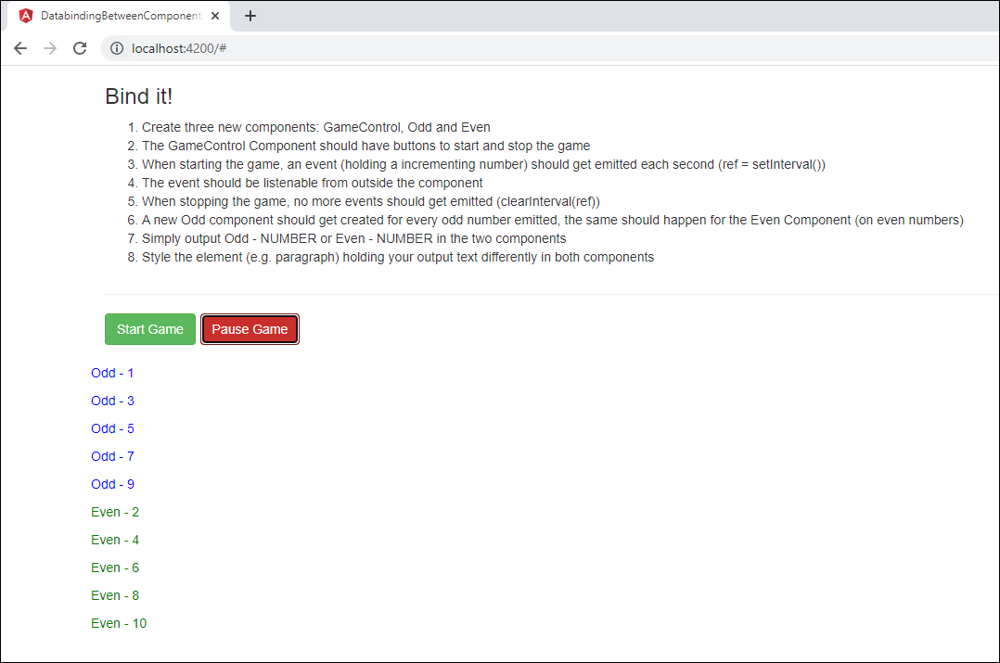

This application demonstrates a very useful example of databinding between the components using input and output events. This way, we can learn how to achieve the communication between different angular components and pass data & events between them.

# This project solves the below problem using Angular

* Create three new components: GameControl, Odd and Even
he GameControl Component should have buttons to start and stop the game
* When starting the game, an event (holding a incrementing number) should get emitted each second (ref = setInterval())
* The event should be listenable from outside the component
* When stopping the game, no more events should get emitted (clearInterval(ref))
* A new Odd component should get created for every odd number emitted, the same should happen for the Even Component (on even numbers)
* Simply output Odd - NUMBER or Even - NUMBER in the two components
* Style the element (e.g. paragraph) holding your output text differently in both components

## Application Output

